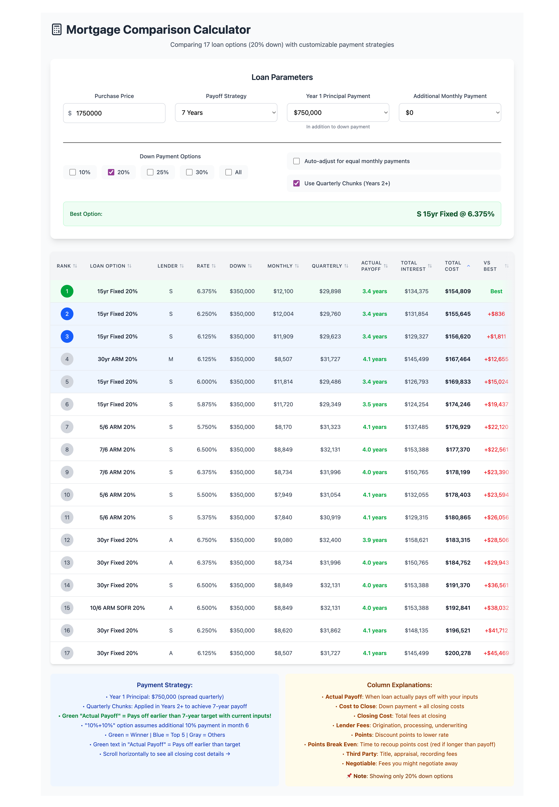

# Mortgage Calculator

A sophisticated mortgage comparison calculator that helps you analyze different loan options and payment strategies to minimize total interest paid.



## Features

- 🏦 **Multiple Loan Comparison**: Compare loans from different lenders side-by-side
- 💰 **Advanced Payment Strategies**: 
  - 7, 10, 15, or 30-year payoff strategies
  - Year 1 bulk principal payments
  - Additional monthly payments
  - Quarterly payment chunks
  - Auto-adjust for equal monthly payments
- 📊 **Comprehensive Analysis**:
  - Total interest calculations
  - Points break-even analysis
  - Actual payoff timeline
  - Cost comparisons between loans
- 🎯 **Smart Filtering**:
  - Filter by down payment percentage
  - Sort by any column
  - Highlight best options
- 💻 **Modern Tech Stack**:
  - React + TypeScript
  - Vite for fast development
  - Tailwind CSS v4 for styling

## Getting Started

### Prerequisites

- Node.js 18+ and npm

### Installation

```bash
# Clone the repository
git clone git@github.com:tommytomatoe/mortgage-calculator.git
cd mortgage-calculator

# Install dependencies
npm install

# Start development server
npm run dev
```

### Building for Production

```bash
# Build the app
npm run build

# Preview production build
npm run preview

# Deploy to Netlify (requires Netlify CLI)
npm run deploy
```

## Adding New Loan Data

Loan data is stored in `src/loanData.json`. To add new loans:

1. Open `src/loanData.json`
2. Add a new loan object to the `loans` array:

```json
{
  "id": 21,                    // Unique ID
  "lender": "X",               // Lender code (single letter recommended)
  "type": "30yr Fixed",        // Loan type (e.g., "30yr Fixed", "15yr Fixed", "7/6 ARM")
  "rate": 6.250,               // Annual interest rate as decimal (6.25% = 6.250)
  "downPct": 20,               // Down payment percentage
  "closingCosts": 25000,       // Total closing costs
  "lenderFees": 1500,          // Lender origination fees
  "pointsFees": 5000,          // Discount points cost
  "thirdPartyFees": 15000,     // Third party fees (title, appraisal, etc.)
  "negotiableFees": 3500,      // Potentially negotiable fees
  "extra10Pct": false          // Optional: for special loan types
}
```

### Loan Data Fields Explained

- **id**: Unique identifier for the loan
- **lender**: Short code for the lender (e.g., "A", "S", "M")
- **type**: Loan product type. Common values:
  - `"30yr Fixed"` - 30-year fixed rate mortgage
  - `"15yr Fixed"` - 15-year fixed rate mortgage
  - `"7/6 ARM"` - 7-year adjustable rate, adjusts every 6 months after
  - `"5/6 ARM"` - 5-year adjustable rate, adjusts every 6 months after
  - `"10/6 ARM SOFR"` - 10-year ARM based on SOFR index
- **rate**: Annual interest rate (e.g., 6.125 for 6.125%)
- **downPct**: Down payment percentage (10, 20, 25, or 30)
- **closingCosts**: Total fees due at closing
- **lenderFees**: Origination and processing fees
- **pointsFees**: Cost of discount points (if any)
- **thirdPartyFees**: Title, appraisal, recording fees
- **negotiableFees**: Fees that might be negotiated away
- **extra10Pct**: (Optional) Special flag for loans with additional features

## Using the Calculator

### Basic Usage

1. **Set Purchase Price**: Enter the home purchase price
2. **Choose Payoff Strategy**: Select how quickly you want to pay off the loan
3. **Configure Payments**:
   - Year 1 Principal: Extra lump sum payment in first year
   - Additional Monthly: Extra amount paid each month
4. **Filter Options**:
   - Down Payment: Show only loans with specific down payments
   - Use checkboxes to select multiple down payment options

### Advanced Features

#### Equal Monthly Payments
Enable "Auto-adjust for equal monthly payments" to calculate the exact monthly payment needed to pay off each loan in your target timeframe. This shows the true cost comparison when all loans are paid with equal monthly payments.

#### Quarterly Chunks
Enable "Use Quarterly Chunks" to model paying extra principal in quarterly lump sums instead of monthly. This can be useful for bonus-based compensation.

#### Understanding the Results

- **Green rows**: Best options based on total cost
- **Blue rows**: Top 5 options
- **Monthly (Equal)**: Shows when equal payment mode is active
- **Points Break Even**: Time to recoup points cost (red if longer than payoff)
- **Actual Payoff**: When the loan actually pays off with your payment strategy

### Column Explanations

- **Rank**: Overall ranking by total cost
- **Monthly**: Required monthly payment (may show base + extra)
- **+Extra**: Additional principal payment per month
- **Quarterly**: Quarterly principal payment (if enabled)
- **Total Interest**: Total interest paid over loan life
- **Total Cost**: Total interest + closing costs
- **vs Best**: Difference from the lowest cost option
- **Points Break Even**: Months to recoup points investment

## Development

### Project Structure

```
mortgage-calculator/
├── src/
│   ├── MortgageCalculator.tsx  # Main calculator component
│   ├── loanData.json           # Loan configuration data
│   ├── App.tsx                 # App wrapper
│   └── main.tsx                # Entry point
├── public/                     # Static assets
└── package.json               # Dependencies and scripts
```

### Key Technologies

- **React 19**: UI framework
- **TypeScript**: Type safety
- **Vite**: Build tool and dev server
- **Tailwind CSS v4**: Styling
- **Lucide React**: Icons

### Contributing

1. Fork the repository
2. Create a feature branch (`git checkout -b feature/amazing-feature`)
3. Commit your changes (`git commit -m 'Add amazing feature'`)
4. Push to the branch (`git push origin feature/amazing-feature`)
5. Open a Pull Request

## License

This project is open source and available under the MIT License.

## Support

For issues, questions, or contributions, please visit the [GitHub repository](https://github.com/tommytomatoe/mortgage-calculator).